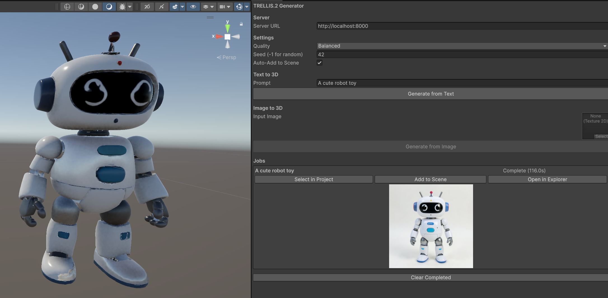

<p align="center">
  
</p>

<h1 align="center">TRELLIS.2 Unity Studio</h1>

<p align="center">
  <b>AI-Powered 3D Generation for Unity</b><br>
  Generate high-quality 3D assets from text or images directly in Unity Editor
</p>

<p align="center">
  <a href="#quick-start">Quick Start</a> •
  <a href="SETUP.md">Detailed Setup</a> •
  <a href="#unity-setup">Unity Setup</a> •
  <a href="#server-setup">Server Setup</a> •
  <a href="#api-reference">API Reference</a>
</p>

---

## Overview

**TRELLIS.2 Unity Studio** provides seamless AI-powered 3D generation directly within Unity. Generate game-ready assets from text descriptions or reference images without leaving the editor. Require machines with 16GB+ VRAM to start.

**Key Features:**
- **Native Unity Integration** — Editor window for generation workflow, supporting both image-to-3d and text-to-3d via Flux 2.
- **Quality Presets** — SuperFast (~15s), Fast (~60s), Balanced (~90s), High (~180s)
- **Auto-Import** — Generated GLBs import directly to project
- **Web Interface** — Optional Gradio UI for standalone use
- **Optional GPT-Image Integration** - Using GPT-Image to replace the flux.2 pipeline for efficiency (Checkout the GPT-Image-API branch for the same usage)

---

## Quick Start

### 1. Clone Repository
```bash
git clone --recursive https://github.com/Scriptwonder/trellis2-unity-studio.git
cd trellis2-unity-studio
```

### 2. Setup HuggingFace Authentication
```bash
# Copy environment template
cp .env.example .env

# Edit .env and add your HuggingFace token
# Get token from: https://huggingface.co/settings/tokens
# Request access to gated models:
#   - https://huggingface.co/collections/facebook/dinov3
#   - https://huggingface.co/black-forest-labs/FLUX.2-klein-4B
nano .env  # or use your preferred editor
```

### 3. Start the Server (Docker - Recommended)
```bash
# Build the image
docker build -f docker/Dockerfile -t trellis2-unity-studio .

# Run server
./run_docker.sh --detach
```

**Alternative: Python Environment**
```bash
# Setup (first time only)
./scripts/setup.sh

# Start API server
python src/trellis2_server.py
```

Server runs at `http://localhost:8000`

### 4. Setup Unity Project
```
1. Copy unity/ folder contents to: Assets/Trellis2/
2. Open Tools > TRELLIS.2 > Generation Window
3. Enter prompt or assign image → Click Generate
4. Model auto-imports to Assets/Trellis2Results/
```

---

## Unity Setup

### Installation

1. **Copy Unity Package**
   ```
   trellis2-unity-studio/unity/  →  YourProject/Assets/Trellis2/
   ```
   
   Files to copy:
   - `Trellis2Client.cs` — Runtime client for API calls
   - `Trellis2Demo.cs` — Example usage component
   - `Editor/Trellis2Window.cs` — Editor window

2. **Install GLB Loader** (recommended)
   - [GLTFUtility](https://github.com/Siccity/GLTFUtility) — Simple, lightweight
   - [UnityGLTF](https://github.com/KhronosGroup/UnityGLTF) — Khronos official

### Editor Window

Open **Tools > TRELLIS.2 > Generation Window**

| Setting | Description |
|---------|-------------|
| Server URL | API endpoint (default: `http://localhost:8000`) |
| Quality | SuperFast / Fast / Balanced / High |
| Seed | Random seed (-1 for random) |
| Auto-Add to Scene | Spawn model on completion |

**Text-to-3D:** Enter prompt → Generate from Text  
**Image-to-3D:** Assign texture → Generate from Image

### Runtime Usage

```csharp
using UnityEngine;
using Trellis2;

public class Generator : MonoBehaviour
{
    Trellis2Client client;

    void Start()
    {
        client = gameObject.AddComponent<Trellis2Client>();
        client.serverUrl = "http://localhost:8000";
        client.quality = GenerationQuality.Balanced;
        client.OnGenerationComplete += OnComplete;
    }

    public void Generate()
    {
        // From text
        client.GenerateFromText("A cute robot toy");
        
        // From texture
        // client.GenerateFromTexture(myTexture);
        
        // From file
        // client.GenerateFromImageFile("/path/to/image.png");
    }

    void OnComplete(GenerationResult result)
    {
        Debug.Log($"GLB: {result.localGlbPath}");
        // Load with GLTFUtility:
        // var model = Importer.LoadFromFile(result.localGlbPath);
    }
}
```

### Coroutine Usage

```csharp
IEnumerator GenerateModel()
{
    GenerationResult result = null;
    
    yield return client.GenerateFromTextCoroutine(
        "A red sports car",
        r => result = r
    );
    
    if (string.IsNullOrEmpty(result.error))
        Debug.Log($"Success: {result.localGlbPath}");
}
```

---

## Server Setup

### Requirements

- **GPU:** NVIDIA with 16GB+ VRAM (24GB+ recommended)
  - Tested on: RTX 4080/5080, A100, H100
  - Minimum: RTX 3090/4090 (16GB VRAM)
- **CUDA:** 12.4 or compatible
- **Python:** 3.10+
- **OS:** Linux (Ubuntu 22.04 recommended)
- **RAM:** 32GB+ system RAM (64GB+ for `keep_loaded` memory mode)
- **HuggingFace Account:** Required for accessing gated models

### HuggingFace Setup

TRELLIS.2 uses several gated HuggingFace models that require authentication and access approval.

**1. Create a HuggingFace account and token:**
   - Sign up at https://huggingface.co
   - Create a token: https://huggingface.co/settings/tokens
   - Select "Read" permission (minimum required)

**2. Request access to these models:**
   - [DINOv3](https://huggingface.co/collections/facebook/dinov3) — Image feature extraction
   - [FLUX.2-klein-4B](https://huggingface.co/black-forest-labs/FLUX.2-klein-4B) — Text-to-image generation
   - [RMBG-2.0](https://huggingface.co/briaai/RMBG-2.0) — Background removal

**3. Configure your token:**
   ```bash
   # Copy environment template
   cp .env.example .env
   
   # Edit .env and paste your token
   # HF_TOKEN=hf_xxxxxxxxxxxxxxxxxxxxx
   nano .env
   ```

### Installation

**Option 1: Docker (Recommended)**

```bash
# Clone with submodules
git clone --recursive https://github.com/Scriptwonder/trellis2-unity-studio.git
cd trellis2-unity-studio

# Setup HuggingFace token (see above)
cp .env.example .env
nano .env  # Add your HF_TOKEN

# Build Docker image
docker build -f docker/Dockerfile -t trellis2-unity-studio .

# Run server
./run_docker.sh --detach
```

**Option 2: Python Environment**

```bash
# Clone with submodules
git clone --recursive https://github.com/Scriptwonder/trellis2-unity-studio.git
cd trellis2-unity-studio

# Run setup script
./scripts/setup.sh

# Or manual setup:
conda create -n trellis2 python=3.10 -y
conda activate trellis2
pip install torch torchvision --index-url https://download.pytorch.org/whl/cu124
pip install -r requirements.txt
cd vendor/TRELLIS.2 && bash setup.sh --basic --flash-attn --nvdiffrast --cumesh --o-voxel

# Login to HuggingFace
huggingface-cli login
# Paste your token when prompted
```

### Running the Server

**API Server (for Unity):**
```bash
cd src
uvicorn trellis2_server:app --host 0.0.0.0 --port 8000
```

**Web Interface (optional):**
```bash
python app.py --port 7860
```

### Docker

**Prerequisites:**
1. **HuggingFace Token** — Required for gated models (DINOv3)
   - Get token from: https://huggingface.co/settings/tokens
   - Request access to: [DINOv3](https://huggingface.co/collections/facebook/dinov3)

2. **Create `.env` file:**
   ```bash
   cp .env.example .env
   # Edit .env and add your HuggingFace token:
   # HF_TOKEN=your_token_here
   ```

**Build the image:**
```bash
docker build -f docker/Dockerfile -t trellis2-unity-studio .
```

**Run with the helper script (recommended):**
```bash
# Default settings (auto-detect memory mode)
./run_docker.sh

# Run in background
./run_docker.sh --detach

# Specify memory mode
./run_docker.sh --memory swap      # 32GB RAM
./run_docker.sh --memory keep      # 64GB+ RAM
```

**Or run manually:**
```bash
docker run --gpus all --rm \
  -p 8000:8000 \
  -v $(pwd)/outputs:/app/outputs \
  -v ~/.cache/huggingface:/root/.cache/huggingface \
  --env-file .env \
  -e MEMORY_MODE=auto \
  --shm-size=8g \
  trellis2-unity-studio
```

Server available at `http://localhost:8000`

---

## API Reference

### Endpoints

| Method | Endpoint | Description |
|--------|----------|-------------|
| `GET` | `/health` | Health check |
| `POST` | `/submit/text` | Submit text-to-3D job |
| `POST` | `/submit/image` | Submit image-to-3D job |
| `GET` | `/status/{job_id}` | Get job status |
| `GET` | `/result/{job_id}` | Get job result |
| `GET` | `/jobs` | List all jobs |
| `DELETE` | `/jobs/{job_id}` | Delete job |

### Text-to-3D

```bash
curl -X POST http://localhost:8000/submit/text \
  -H "Content-Type: application/json" \
  -d '{"prompt": "A cute robot toy", "quality": "balanced", "seed": 42}'
```

Response:
```json
{"job_id": "abc123", "status": "queued"}
```

### Image-to-3D

```bash
curl -X POST http://localhost:8000/submit/image \
  -F "file=@input.png" \
  -F "quality=balanced" \
  -F "seed=42"
```

### Check Status

```bash
curl http://localhost:8000/status/{job_id}
```

Response:
```json
{
  "job_id": "abc123",
  "status": "done",
  "result": {
    "glb": "download/abc123/model.glb",
    "image": "download/abc123/image.png"
  }
}
```

### Quality Presets

| Preset | Time | Resolution | Use Case |
|--------|------|------------|----------|
| `superfast` | ~15s | 512³ | Real-time iteration, prototyping |
| `fast` | ~60s | 512³ | Quick iterations, mobile |
| `balanced` | ~90s | 512³ | General use, games |
| `high` | ~180s | 1024³ | Hero assets, cinematics |

---

## Project Structure

```
trellis2-unity-studio/
├── app.py                 # Gradio web interface
├── requirements.txt       # Python dependencies
├── src/
│   ├── trellis2_server.py # FastAPI server
│   └── trellis2_wrapper.py# Generation wrapper
├── unity/
│   ├── Trellis2Client.cs  # Unity runtime client
│   ├── Trellis2Demo.cs    # Example component
│   └── Editor/
│       └── Trellis2Window.cs  # Editor window
├── scripts/
│   └── setup.sh           # Installation script
├── vendor/
│   └── TRELLIS.2/         # Core ML model (submodule)
└── outputs/               # Generated files
```

---

## Troubleshooting

### Common Issues

| Issue | Cause | Solution |
|-------|-------|----------|
| `401 Unauthorized` / `GatedRepoError` | Missing or invalid HuggingFace token | 1. Check `.env` file has correct `HF_TOKEN`<br>2. Request access to gated models<br>3. Ensure token has "Read" permission |
| Server not responding | Server not started or crashed | Check `docker logs trellis2-unity-studio` or server logs |
| `CUDA out of memory` | VRAM insufficient for quality preset | Use lower quality (`fast` or `superfast`)<br>Set `MEMORY_MODE=swap` |
| Import errors in container | Missing dependencies or build issues | Rebuild image: `docker build --no-cache -f docker/Dockerfile .` |
| GLB not loading in Unity | Missing GLB loader plugin | Install [GLTFUtility](https://github.com/Siccity/GLTFUtility) or [UnityGLTF](https://github.com/KhronosGroup/UnityGLTF) |
| Slow generation | Heavy quality preset or swap mode | Use `fast`/`superfast` preset<br>Increase RAM for `keep_loaded` mode |
| Connection refused | Server not running or wrong port | Verify server at `http://localhost:8000/health`<br>Check firewall settings |

### Diagnostic Commands

```bash
# Check server health
curl http://localhost:8000/health

# View Docker container logs
docker logs -f trellis2-unity-studio

# Check HuggingFace token is loaded
docker exec trellis2-unity-studio printenv HF_TOKEN

# Test model download (inside container)
docker exec -it trellis2-unity-studio python3 -c "from huggingface_hub import login; login(token='YOUR_TOKEN')"

# Clear HuggingFace cache and rebuild
rm -rf ~/.cache/huggingface
docker build --no-cache -f docker/Dockerfile -t trellis2-unity-studio .

# Clear generated files
rm -rf outputs/*
```

### Memory Modes

| Mode | RAM Required | Speed | When to Use |
|------|-------------|-------|-------------|
| `keep_loaded` | 64GB+ | Fastest | Multiple text-to-3D generations |
| `swap` | 32GB+ | Slower | Limited RAM, mixed workloads |
| `auto` | Any | Auto-detects | Default, recommended |

Set via environment variable:
```bash
docker run ... -e MEMORY_MODE=swap ...
# or
./run_docker.sh --memory swap
```

---

## License

MIT License — see [LICENSE](LICENSE)

Built on [Microsoft TRELLIS.2](https://github.com/microsoft/TRELLIS.2) (MIT License)

---

<p align="center">
  <b>Generate 3D assets with AI, directly in Unity</b><br>
  <a href="https://github.com/Scriptwonder/trellis2-unity-studio">GitHub</a> •
  <a href="https://github.com/Scriptwonder/trellis2-unity-studio/issues">Issues</a>
</p>
